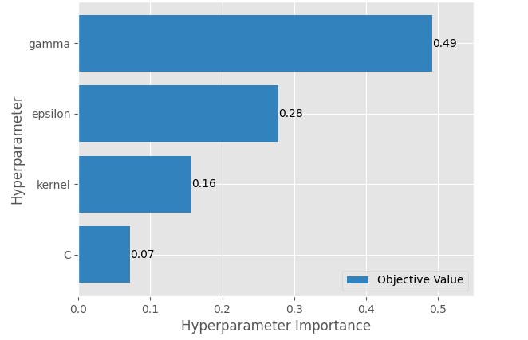

# House-Price-Prediction-and-Titanic-Survival-Prediction-Focus-on-Hyperparameter-Tuning
This is a machine learning workflow, from data preprocessing to training, evaluation, and making predictions, using both classification and regression problems. I'm making a focus on hyperparameter tuning by using techniques like Zooming In and Bayesian Optimization!!

* The **Zooming In** technique is a strategy where you refine the hyperparameter search space iteratively. Starting with a broad search space you perform an initial search (using GridSearchCV for example) to identify promising regions of the space. Then, in subsequent iterations, you narrow the range of hyperparameters (Zoom In) around the best-performing values from the previous step and search again. This approach balances exploration (finding promising regions) and exploitation (fine-tuning within those regions).
* **Bayesian Optimization** is a sequential optimization technique that efficiently finds the best hyperparameters by building a probabilistic model of the objective function and then selecting the promising hyperparameters. To Implement it, i'm going to use a technique called Tree-structured Parzen Estimators (TPE). Instead of modeling the objective function directly, TPE builds two probability distribution, one for good hyperparameters and another one for bad hyperparameters.

# Notebook's Table of content

#### Part 1: Data Preprocessing
- Step 1: Load and Inspect Data
- Step 2: Handle Missing Data

#### Part 2: Feature Engineering
- Step 1: Encoding Categorical Variables
- Step 2: Feature Scaling

#### Part 3: Classification Task (Titanic Dataset)
- Step 1: Splitting Data
- Step 2: Train Classification Models using Zooming In technique: Logistic Regression, KNN, Decision Tree, AdaBoost, SVC
- Step 3: Models Evaluation on Test Set
- Step 4: Making Predictions

#### Part 4: Regression Task (House Prices Dataset)
- Step 1: Splitting Data
- Step 2: Train Regression Models using Bayesian Optimization: SVR, RandomForestRegressor, MLPRegressor, Linear Regression
- Step 3: Model Evaluation
- Step 4: Making Predictions

# Key Insights
## Classification: Titanic Survival Prediction
#### ✅ Best Performing Model
**AdaBoostClassifier** achieved the highest accuracy (~76%), outperforming Logistic Regression, KNN, Decision Tree and SVC
#### 🔍 Hyperparameter Tuning Impact
Adjusting `n_estimators` and `learning_rate` in **AdaBoostClassifier** improved accuracy by ~1.5% compared to initial settings.
#### 📊 Key Features Influencing Survival
**Age** and **Fare** were the two most important features with respectively **25.9%** and **24.56%** of Importance 

---
## Regression: House Price Prediction
#### ✅ Best Performing Model
**SVR**(Optimized using Bayesian Optimization) achieved the highest accuracy (~99.96%), outperforming RandomForestRegressor, MLPRegressor and Linear Regression
#### 🔍 SVR Hyperparameter Importance
While optimizing the SVR model, **gamma** and **epsilon** are the most influential hyperparameters affecting model performance   

#### 📊 Key Features Influencing Survival
**Year** and **Mileage** were the two most important features with respectively **40.78%** and **28.59%** of Importance 

---
## Zooming In vs. Bayesian Optimization
